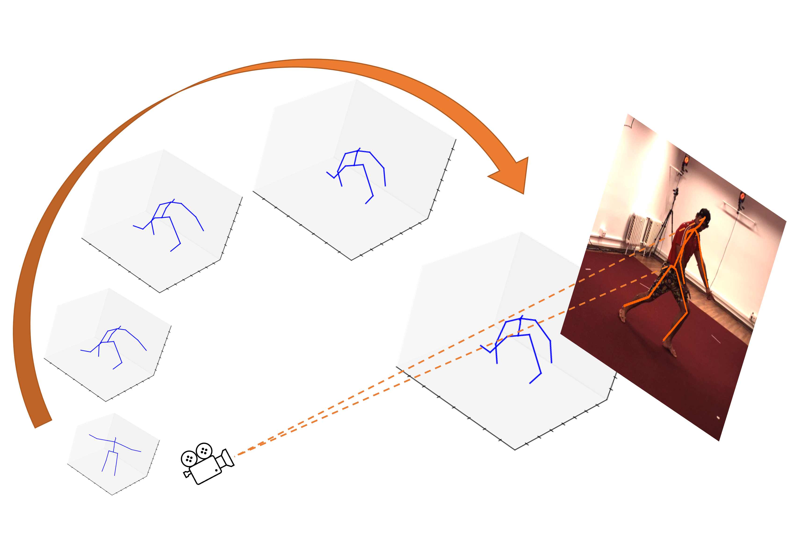
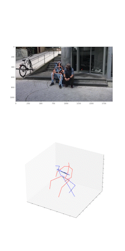
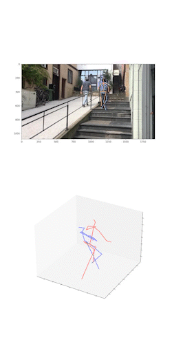
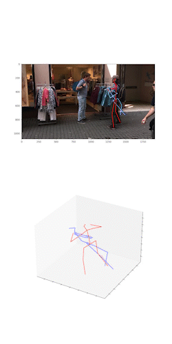
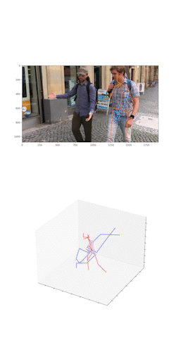

# ZeDO: Back to Optimization: Diffusion-based Zero-Shot 3D Human Pose Estimation

[](https://arxiv.org/abs/2307.03833)
<p align="center"></p>

This is the official implementation of this paper:

> Zhongyu Jiang, Zhuoran Zhou, Lei Li, Wenhao Chai, Cheng-Yen Yang, and Jenq-Neng Hwang. [Back to Optimization: Diffusion-based Zero-Shot 3D Human Pose Estimation](https://arxiv.org/abs/2307.03833) arXiv preprint arXiv:2307.03833 (2023).

<p align="center">
  
  
  
  
</p>

### Results on 3DPW
Under PA-MPJPE and MPJPE

<table>
    <tr>
        <td>Methods</td>
        <td>CE</td>
        <td>Opt</td>
        <td>PA-MPJPE &darr;</td>
        <td>MPJPE &darr;</td>
    </tr>
    <tr>
        <td>SPIN</td>
        <td></td>
        <td></td>
        <td>59.2</td>
        <td>96.9</td>
    </tr>
    <tr>
        <td>VIBE</td>
        <td></td>
        <td></td>
        <td>51.9</td>
        <td>82.9</td>
    </tr>
    <tr>
        <td>PARE</td>
        <td></td>
        <td></td>
        <td>46.4</td>
        <td>74.7</td>
    </tr>
    <tr>
        <td>HybrIK</td>
        <td></td>
        <td></td>
        <td>45.0</td>
        <td>74.1</td>
    </tr>
    <tr>
        <td>HybrIK</td>
        <td><span>&#10003;</span></td>
        <td></td>
        <td>50.9</td>
        <td>82.0</td>
    </tr>
    <tr>
        <td>PoseAug</td>
        <td><span>&#10003;</span></td>
        <td></td>
        <td>58.5</td>
        <td>94.1</td>
    </tr>
    <tr>
        <td>AdaptPose</td>
        <td><span>&#10003;</span></td>
        <td></td>
        <td>46.5</td>
        <td>81.2</td>
    </tr>
    <tr>
        <td>PoseDA</td>
        <td><span>&#10003;</span></td>
        <td></td>
        <td>55.3</td>
        <td>87.7</td>
    </tr>
    <tr>
        <td>ZeDO (J=17)</td>
        <td><span>&#10003;</span></td>
        <td><span>&#10003;</span></td>
        <td><b>40.3</b></td>
        <td><b>69.7</b></td>
    </tr>
    <tr>
        <td>ZeDO (J=14)</td>
        <td><span>&#10003;</span></td>
        <td><span>&#10003;</span></td>
        <td><b>43.1</b></td>
        <td><b>76.6</b></td>
    </tr>
    <tr>
        <td>ZeDO (J=17, Additional Training Data)</td>
        <td><span>&#10003;</span></td>
        <td><span>&#10003;</span></td>
        <td><b>38.4</b></td>
        <td><b>68.3</b></td>
    </tr>
    <tr>
        <td>ZeDO (J=17, S=50, Additional Training Data)</td>
        <td><span>&#10003;</span></td>
        <td><span>&#10003;</span></td>
        <td><b>30.6</b></td>
        <td><b>54.7</b></td>
    </tr>
</table>


# Evaluate model

### Envrionment Setup
- pytorch >= 1.10
```
conda create -n ZeDO python==3.9
conda activate ZeDO
pip install -r requirements.txt
```

### Data and Model Preparation
Evaluation dataset, clusters and checkpoint: [Google Drive](https://drive.google.com/drive/folders/1A15nQ4-Rbp-rKDzfae4e2xAd9V7d4TEA?usp=sharing)

```
${POSE_ROOT}
|-- configs
|-- lib
|-- run
|-- checkpoint
    |-- concatebb
        |-- checkpoint_1500.pth
|-- data
    |-- h36m
        |-- h36m_test.pkl
        |-- h36m_sh_dt_ft.pkl
    |-- 3dpw
        |-- pw3d_test.npz
    |-- 3dhp
        |-- mpii3d_test.pkl
|-- clusters
    |-- 3dhp_cluster1.pkl
    |-- h36m_cluster1.pkl
    |-- 3dhp_cluster50.pkl
    |-- h36m_cluster50.pkl
```

### Evaluation script
```
python -m run.opt_main --config configs/subvp/concat_pose_optimization_<dataset>.py --ckpt_dir ./checkpoint/concatebb --ckpt_name checkpoint_1500.pth --hypo 1 <--gt> 
```

# Citation
If you find this code useful in your project, please consider citing:
```
@article{jiang2023back,
  title={Back to Optimization: Diffusion-based Zero-Shot 3D Human Pose Estimation},
  author={Jiang, Zhongyu and Zhou, Zhuoran and Li, Lei and Chai, Wenhao and Yang, Cheng-Yen and Hwang, Jenq-Neng},
  journal={arXiv preprint arXiv:2307.03833},
  year={2023}
}
```

# Acknowledgement
This repo is built on the excellent work [score_sde](https://github.com/yang-song/score_sde_pytorch) by Yang Song and [GFPose](https://github.com/Embracing/GFPose) by Hai Ci.
